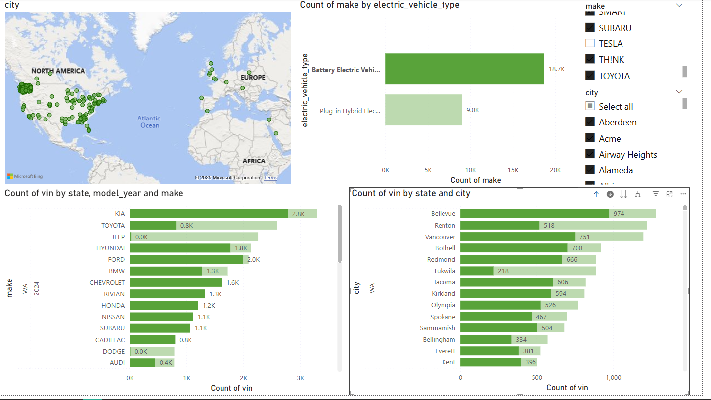
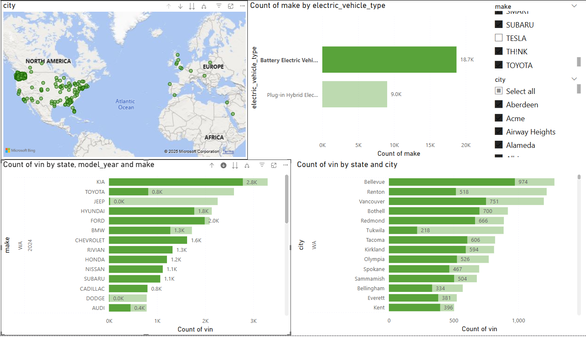
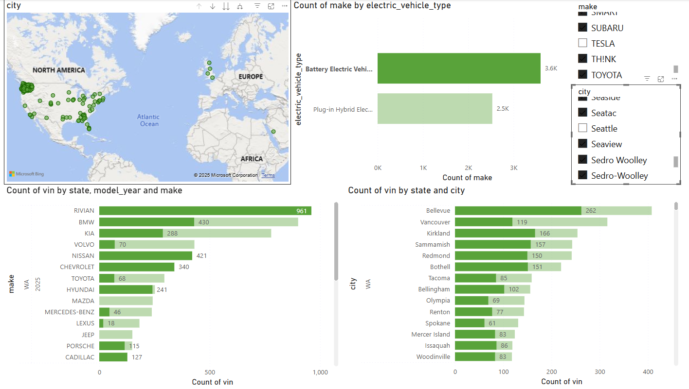
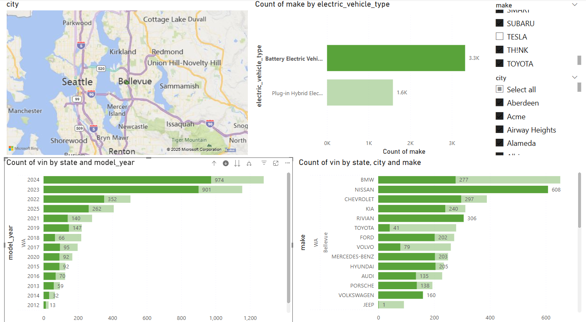
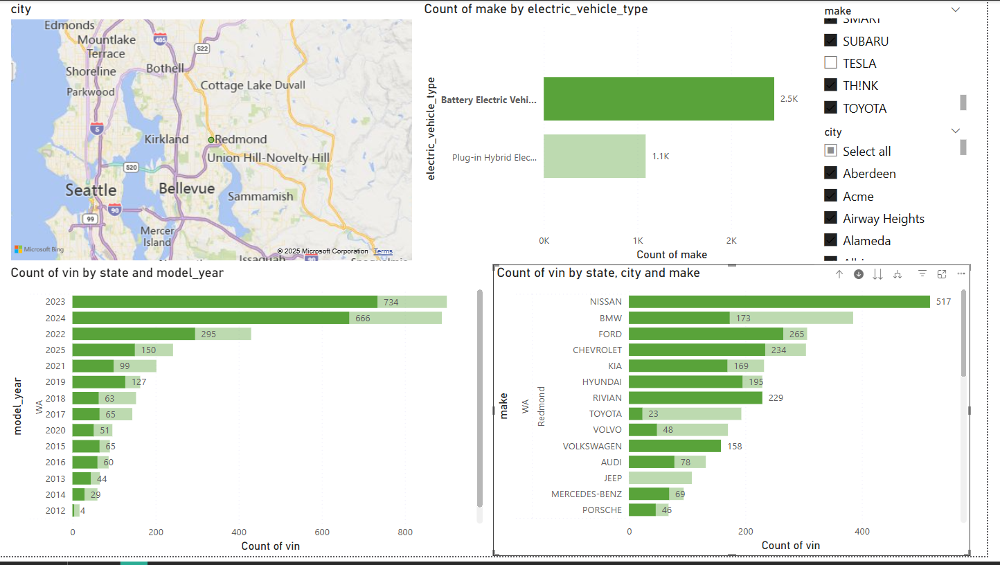
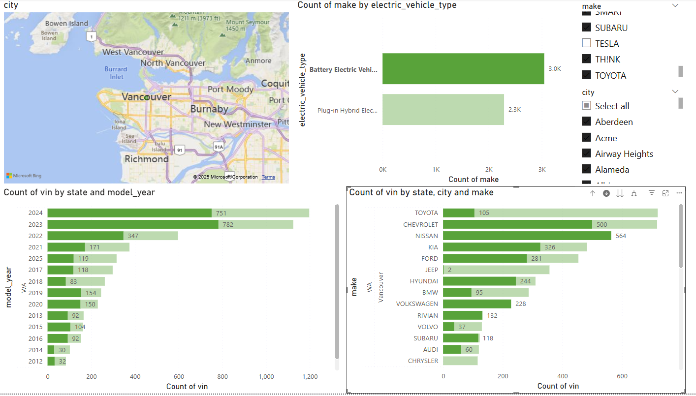
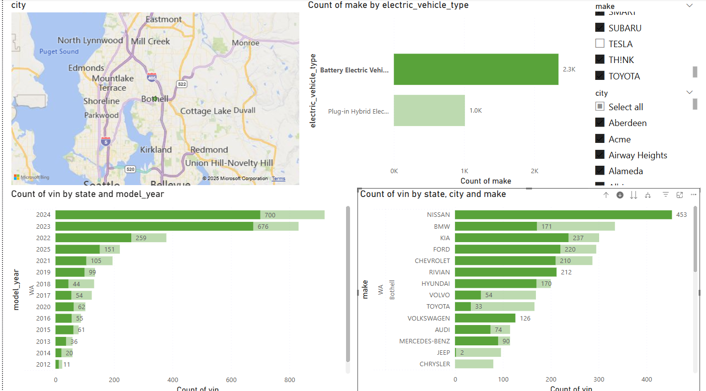
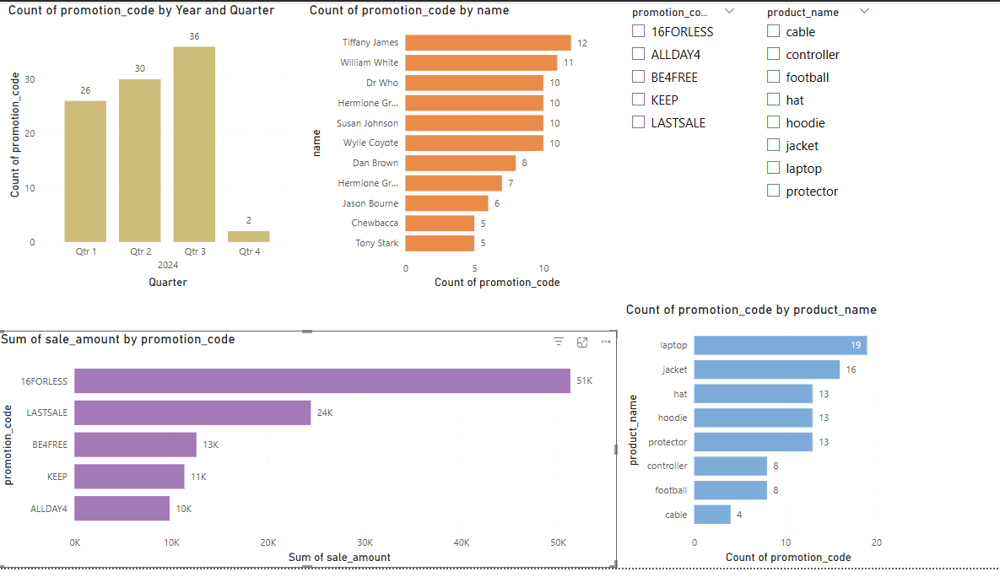

# Project 7 - Dealership Location for EVs

## Section 1. The Business Goal
A business owner wishes to build an EV dealership in three different cities in the state of Washington.  They do not want to build in Seattle. They do not want to sell Tesla cars, but would like recommendations on other makes that customers tend to own in that city.  They want data from 2024 and first quarter of 2025 to base their decision on.  

## Section 2. Data Source
The data for this project comes from State of Washington data.wa.gov
with title "Electric Vehicle Population Data"
with metadata updated April 19th, 2025

## Section 3. Tools Used
There was some data cleaning needed.  The areas which needed updated were determined based on the output of etl-to-dw-electric-vehicle.py.
Python etl-to-dw-electric-vehicle.py was used to parse the data into data warehouse, electric-vehicle.db.
Visualization report was created in Power BI.


## Section 4. Workflow & Logic
A power Bi visualization was created with the following:
count of electric vehicle type with the client wanting Battery Electric considered over Electric Hybrid models.
map location of the cities in Washington State. (It render properly when drilling down into the cities.)
There is a slicer filter for make where we exclude Tesla and one for city to exclude Seattle.
There are two clustered bar charts. One which focuses on Model Year.  The other focuses on city.
Both cluster bar charts contain make and model.



## Section 5. Results (narrative + visualizations)






This data shows Rivian, BMW, and KIA had the most owners.
It also shows Bellevue, Redmond, Vancouver, and Bothell would be where more EVs are owned.






## Section 6. Suggested Business Action

Dealership 1 should be at Bellevue and sell BMW. This is in demand in Bellevue.
Dealership 2 should be at Bothell and sell KIA. This is in demand in Bothell.
Dealership 3 should be at Redmond and sell RIVIAN.  It is an up and comer in 2025.

Vancouver was not selected since the business owner decided to build in the United States.

There are other factors to consider beyond this assessment. Like location, other dealership competiton, etc.  The purpose of this assessment is demand focused for city and model for 2025 and 2024.

## Section 7. Challenges
It was a little hard going through screens to come up with the conclusion.  I think the conclusions were sound and helpful to the business partner. But I had to compare screens. I wish that were not the case.

## Section 8. Ethical Considerations
There was some indication a position location was in the data set.  I find that very concerning.  I'm not sure it is in the driver's best interest to be tracking this.  I would be somewhat upset about that. It really brings to light this whole AI/BI conversation.  What data should be gathered and how should it be used.  Will AI do want it wants.  I think so. Humans need to focus on holding it back.  I think that will be the challenge.  Not so much what AI can do.  Rather can we stop it.


# smart-store-aaron
#
# Project 6 - The Promotion


## Section 1. The Business Goal
The business would like to know how its use of promotional codes and its impact on sales.  They would like to know what codes were used most and what products were purchased.
## Section 2. Data Source
I used my data warehouse that we have been working on in this class.
promotion_code, sale_amount, name, product_name
## Section 3. Tools
I felt I had enough options in PowerBI to complete the assessment.
## Section 4. Workflow & Logic
I needed multiple ways to show the data to the user. Promotion Code was used to show in different charts along with some other data points.  

Here are some examples.




## Section 5. Results

In Q1 the 16FORLESS promotion code had the highest sales. 


In Q2 the 16FORLESS promotion code had the highest sales.


In Q3 LASTSALE and 16FORLESS promotion codes had almost the same amount of sales at 9K and 8.7 k with KEEP promotion code close with 8k in sales.


Q4 just had two sales with the 16FORLESS promotion code used once for a 5.6k sale.

Overall the main two promotional codes were LASTSALE and 16FORLESS. LASTSALE then ALLDAY4 were the Promotional codes used the most.

Laptops were the highest sale item with 8 sold under the 16FORLESS Promotion code.


There were a realtively small amount of orders anaylazed, 94.  But for this sample we can recommend some actions.

Section 6: Suggested Business Action 
I would suggest removing laptops from 16FORLESS promotion code.  The promotion code could still be used on other sales, but I would remove it to keep more profit on those sales.
That may rasie the question what about the other for promotional codes.  I would say limit the precentage discount on laptops or exclude them all together.

Section 7. Challenges
I was somewhat divided whether I should use a python OLAP or POWER BI with OLAP.  I decided to go with PowerBI for P6 since I felt it had all the tools and views necessary.  This includes the slice and dice through the data to help answer the business questions I had.


# Project 5

Describe your SQL queries and reports.
I used the SQL from the description.  I had trouble getting it to run in Power Query and Advanced Editor.  CHATGBT helped me find out that I needed to use the Advanced Options when connecting with ODBC.  

Here are the steps/

Open Power BI Desktop

Go to the Home tab at the top

Click Get Data → Select ODBC

In the ODBC window, you’ll see:

🔘 Data source name (DSN) — pick your DSN (e.g., SmartSalesDSN)

✅ Below that, you’ll see a small clickable “Advanced options” link/dropdown.

👉 Click on Advanced options and it will expand the panel.


Explain dashboard design choices.  
I designed my dashboard with the items called out in the instructions, but I did add all the items from seperated sections of the instructions.

Include screenshot of: Power BI Model View / Spark SQL Schema


Include screenshot of: Query results


Include screenshot of: Final Dashboard / Charts


Project 4

I had to change file paths to get the dw file in the correct location while still have the etl_to_dw.py in scripts folder.
I had to change the name of the columns.  I'm not sure if that is correct or not, but that worked for me.
I had to update the columns for the additional columns I had made.

Project 3
## Scripts used
```
data_prep.py  This script can be used for data cleaning
```
```
data_scrubber.py  This script holds the indvidual clean methods and called by data_prep.py
```
```
test_data_scrubber.py  This script can be used for testing cleaning programs.
```


# 
Project 2
## How to Install and Run the Project

Create a new repo in Git Hub.  Make sure to include README when creating the new repo.

Clone the new repo to your machine.
```
git clone https://github.com/hrawp/smart-store-aaron
```

Add a .gitignore file with:
# Python virtual environment
'.venv/'

# Visual Studio Code settings and workspace
'.vscode/'

added so .venv files will not be sent up to your repo.

Create a virtual environement by running this command
```
python -m venv .venv
```

Activate the environment by running this command
```
.\.venv\Scripts\activate
```

Update the requirements.txt with libraries that need to be installed.


Run the three Git commands to stange and transmit files to GitHub
```
git add .
```
```
git commit -m "initial commit"
```
```
git push origin main
```


